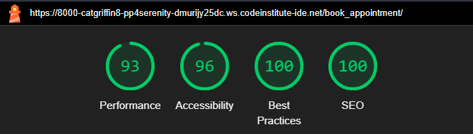

# Serenity Escape Spa

## Introduction to Serenity Escape Spa Website

This website is designed to create a relaxing and user-friendly online presence for the Serenity Escape Spa. The website enables users to explore a range of rejuvenating spa services, book appointments effortlessly, and connect with the spa team for any inquiries.
Whether you’re seeking a tranquil escape or an appointment for a specific service, the Serenity Escape Spa website aims to deliver a seamless digital experience for both clients and administrators.

You can view Serenity Escape Spa Website [here](https://serenity-escape-spa-7cbc127367b8.herokuapp.com/)

Link to admin panel: [here](https://serenity-escape-spa-7cbc127367b8.herokuapp.com/admin/login/?next=/admin/)

Git Hub repository: [here](https://github.com/catgriffin85/pp4-serenity-escape-spa)

<u>Admin login:</u>

username: catgriffinpp4

password: Serenity-escape

## Key Features

* <strong>Homepage: </strong> A welcoming introduction to the spa, featuring key highlights and testimonials.
* <strong>Treatments Page: </strong> A detailed overview of spa services, including descriptions, pricing, and durations.
* <strong>User login: </strong> Users can register, login and log out to book and view their appointments.
* <strong>Booking System: </strong> Users can book appointments online by selecting their desired service, date, and time. They can also update their appointment and cancel their apppointments. Admins can manage bookings, update service offerings, and adjust available time slots.

This project has been developed using Agile methodology, ensuring iterative improvements and a user-focused design.

## Project Goals

* To create a website that is easy for users to navigate and use.
* To create a visually appealing website.
* Allow users to book and manage their appointments.
* Have a website that is responsive on all devices.
* To create an admin panel for a superuser to manage appointments and services.

## User Stories

### User Story 1: Homepage

<strong>User Story 1:1</strong>

As a user, I want to view a visually appealing homepage, so that I can understand the spa's offerings at a glance.
Acceptance Criteria:
* Displays a hero image with a welcoming message.
* Includes navigation links to other pages.
* Brief description of the spa's unique selling points.

<strong>User Story 1:2</strong>

As a user, I want to see customer reviews, so that I can trust the spa's services.
Acceptance Criteria:
* Testimonials section with 2-3 reviews displayed prominently.
* Option for admin to add/edit/remove reviews.

### User Story 2: Treatment Page

<strong>User Story 2:1</strong>

As a user, I want to view a list of services, so that I can choose the one that suits me.
Acceptance Criteria:
* Each service includes a name, description, duration, and price.
* Easy-to-navigate layout with clear categories (if needed).

<strong>User Story 2:2</strong>

As an admin, I want to add, edit, or remove services, so that I can keep the services list up-to-date.
Acceptance Criteria:
* Admin panel for managing services.
* Changes are reflected immediately on the services page.

<strong>User Story 2:3</strong>

As a user, I want to create an account, so that I can book an appointment for my preferred service.
Acceptance Criteria:
* Option to create a new account.
* Option to log in for users with an existing account.
* Option to log out once user has logged in.
* View of all previously booked appointments once logged in.
* View of all future appointments once logged in.

<strong>User Story 2:4</strong>

As a user, I want to book an appointment online, so that I can schedule a service at my convenience.
Acceptance Criteria:
* Booking form allows service selection, date, time, and user details.
* Confirmation message is displayed to the user upon successful booking.
* Ability to update and cancel my appointments.

<strong>User Story 2:5</strong>

As an admin, I want to view all appointments, so that I can manage the spa's schedule efficiently.
Acceptance Criteria:
* Admin dashboard displaying upcoming appointments with details.
* Option to filter by date or service type.

### Prioritisation

<strong>Must Have (MVP)</strong>
* Homepage (User Story 1.1)
* Services Page (User Story 2.1, 2.2)
* Booking System (User Story 2.4)
* Admin Panel (User Story 2.5)

<strong>Should Have</strong>
* Customer Reviews (User Story 1.2)

<strong>Nice to Have</strong>
* Contact Us Page
* About Us Page

## Design

<strong>Look and feel</strong>

For the design of this website, I wanted to create a feeling of calm and relaxation for users when viewing my site. To do this I utilised a range of orange shades to create a cohesive visual palette. These colours vary from soft and warm tones to bolder tones, adding depth and contrast to the design.

<strong>Font</strong>

I used [Google Fonts](https://fonts.google.com/) for my font selection.

Ysabeau Infant was used as the font for this website. This font was choosen because I felt like it added to the calm and relaxing feel of the site. Fall back font is Sans-serif.

## Wireframes

Before starting the project, I created wireframes to map out the initial design and functionality. These wireframes served as a blueprint to guide the development process. However, as the project progressed, I deviated from the original plan in several areas.

This evolution was driven by practical considerations, feedback during development, and a focus on improving usability. I revisited the initial design choices and implemented adjustments that enhanced the overall user experience. The final design reflects these improvements, resulting in a more intuitive and user-friendly interface than originally envisioned.

By allowing flexibility in the design process, I was able to refine and elevate the project's quality beyond the initial concept.

<strong>Homepage wireframe</strong>

<strong>Treatment page wireframe</strong>

Before user logs in:

After user logs in:

<strong>About Us & Contact Pages</strong>

This pages were not used in the final project, instead the About Us including how to contact the spa were incorporated into a seperate Book Appointment page.

## Database Schemes

## Agile Development

Link to my [GitHub Project](https://github.com/users/catgriffin85/projects/4)

This was my first experience with Agile Development, and I chose to use the Kanban framework alongside the MoSCoW prioritization method. To manage the workflow, I utilized GitHub Projects to create a Kanban board.

As a solo developer working under strict timelines, I found creating all the Epics and User Stories to be somewhat time-consuming. However, I can see the significant advantages of this approach, particularly in a team setting, where it promotes organization and collaboration.

Moving forward, I plan to continue using Agile methodologies in my future projects to further develop my skills.

I created 4 columns - Open, In progress, Done and No Longer Required. 

For the MoSCoW priorisation I used - Must Have (MVP), Should Have and Nice to Have.

Example:

## Tools and technologies used

<strong>Languages and Frameworks</strong>

This project was created using the following languages and frameworks:

* Django as the Python web framework.
    * Python as the backend programming language.
* HTML as the markup language and templating language.
* CSS as the style sheet language.
* Bootstrap 5 as the CSS framework.

<strong>Django Packages</strong>

Django installs some packages by default and some packages I installed. Below are a list of the main packages I used and a description. Description taken from the web.

Django Python - pip3 install Django~=4.2.1

<u>Gunicorn</u>

gunicorn is a production equivalent of the manage.py runserver used in development but with speed and security optimisation.

<u>Whitenoise</u>

WhiteNoise works with any WSGI-compatible app but has some special auto-configuration features for Django. WhiteNoise takes care of best-practices.

<u>Psycopg2</u>

psycopg2 is a driver for interacting with PostgreSQL databases using Python. The dj-database-url Python package is a utility to connect Django to a database using a URL.

<u>Allauth</u>

Django-allauth is a Django package that provides a set of views, templates, and helper functions to handle user authentication, registration, and account management.

<u>Django summernote</u>

Django summernote transforms the admin page, allowing rich text, that is, text with various formats like headings and paragraphs, unlike the plain text that Django's default textarea supports. It embeds a 'what you see is what you get' (WYSIWYG) editor, offering a live preview of the content and making editing intuitive.

<u>Django-crispy-forms</u>

Django-crispy-forms provides you with a |crispy filter and  tag that will let you control the rendering behavior of your Django forms in a very elegant and DRY way. Have full control without writing custom form templates.

<u>Django-flatpickr</u>

This django widget contains Date-Picker, Time-Picker, DateTime-Picker input widgets with date-range-picker functionality for django version >= 2.0. The widget implements flatpickr to display date-pickers in django model forms and custom forms which can be configured easily for date-range selection.

<strong>Other tools used</strong>

* [Font Awesome](https://fontawesome.com/) was used for all icons.
* [Balsamiq](https://balsamiq.com/) was used to create the wireframes.
* [Favicon.io](https://favicon.io/) was used to create the favicon.
* [GitHub](https://github.com/) for hosting repositories.
* [Heroku](https://www.heroku.com/home) where the website is deployed.

## Features

## Testing

Thorough testing was a crucial part of this project to ensure functionality, usability, and reliability. I implemented a range of testing methods to identify and resolve issues at different stages of development. These included manual testing for user experience, functional testing to confirm that features behaved as intended, and debugging to address any errors or inconsistencies.

This section outlines the tests conducted during the project, the issues identified, and the steps taken to resolve them. Additionally, I highlight any limitations discovered during testing and suggest potential areas for future improvement.

<strong>Lighthouse</strong>

Homepage:

Treatments page:

Book Appointment page:

List Appointments page:

<strong>Validators</strong>

W3C HTML Validator:

W3C CSS Validator:

CI Python Lintor:

<u>Serenity Escape App</u>

settings.py file

CHECK

urls.py file

<strong>Treatments App</strong>

models.py file

views.py file

<strong>Book Appointment App</strong>

admin.py file

forms.py file

models.py file

CHECK

views.py file

CHECK

## Bugs

<strong>Fixed Bugs</strong>

After creating my first database, I change the name of the model but it didn’t change the name of the database. I deleted the migration and migrated again but that didn’t fix it. I had to add code to the meta class to change the name of the database which then worked.

<strong>Unfixed Bugs</strong>

When users open the date picker to select an appointment I wanted to disable the list of blocked dates on the calendar. After many tries, googling, talking to my mentor I could not get it to work the way I wanted it to work. I did manage to block out Sundays but any time I disabled the blocked dates it changed the format of my date picker which I didn't want. Ultimately I decided to proceed without the dates being blocked on the date picker but users will get an error message if they try to select one of the blocked dates. 

## Deployment to Heroku

Credit to [Jorgen Brattang](https://github.com/JorgenBrattang/daily-math) for the description

* The requirements.txt file in the IDE must be updated to package all dependencies. To do this:
    * Enter the following into the terminal: 'pip3 freeze > requirements.txt'
    * Commit the changes and push to GitHub
* Go to Heroku.com and sign in or create a free account.
* From the heroku dashboard click the 'Create new app' button.
* Name the app something unique and choose what region you are in then click 'Create app'.
* Go to the settings tab and find the Config Vars section. Click 'Reveal Config Vars'.
* In the field for KEY enter the value CREDS in all capitals.
* In the field for VALUE copy and paste the entire contents of your creds.json file from your project. Then click 'Add'.
* In the field for KEY enter PORT in all capitals, then in the field for VALUE enter 8000. Then click 'Add'.
* Scroll down to the Buildpacks section and click 'Add buildpack'.
* Click Python then save changes.
* Add another buildpack by clicking 'Add buildpack' and this time click Nodejs then save changes.
* Make sure that Python appears above Nodejs in the buildpack section. If it does not you can click and drag them to change the order.
* Then head over to the deploy section by clicking deploy from the nav bar at the top of the page.
* From the 'Deployment method' section select GitHub and click 'Connect to GitHub'.
* Enter the repository name as it is in GitHub and click 'search'.
* Click the 'connect' button next to the repository to link it to heroku.
* To deploy, scroll down and click the 'Deploy Branch' button.
* Heroku will notify you that the app was successfully deployed with a button to view the app.
* If you want to rebuild your app automatically you can also select the 'Enable Automatic Deploys' button which will then rebuild the app every time you push any changes.

