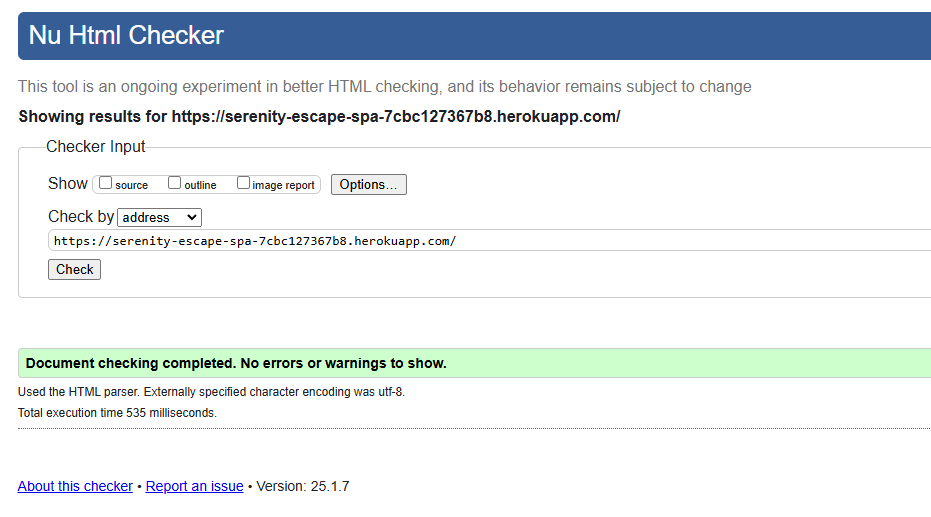

# Serenity Escape Spa

## Introduction to Serenity Escape Spa Website

This website is designed to create a relaxing and user-friendly online presence for the Serenity Escape Spa. The website enables users to explore a range of rejuvenating spa services, book appointments effortlessly, and connect with the spa team for any inquiries.
Whether you’re seeking a tranquil escape or an appointment for a specific service, the Serenity Escape Spa website aims to deliver a seamless digital experience for both clients and administrators.

You can view Serenity Escape Spa Website [here](https://serenity-escape-spa-7cbc127367b8.herokuapp.com/)

Link to admin panel: [here](https://serenity-escape-spa-7cbc127367b8.herokuapp.com/admin/login/?next=/admin/)

Git Hub repository: [here](https://github.com/catgriffin85/pp4-serenity-escape-spa)

<u>Admin login:</u>

username: catgriffinpp4

password: Serenity-escape

## Key Features

* <strong>Homepage: </strong> A welcoming introduction to the spa, featuring key highlights and testimonials.
* <strong>Treatments Page: </strong> A detailed overview of spa services, including descriptions, pricing, and durations.
* <strong>User login: </strong> Users can register, login and log out to book and view their appointments.
* <strong>Booking System: </strong> Users can book appointments online by selecting their desired service, date, and time. They can also update their appointment and cancel their apppointments. Admins can manage bookings, update service offerings, and adjust available time slots.

This project has been developed using Agile methodology, ensuring iterative improvements and a user-focused design.

## Project Goals

* To create a website that is easy for users to navigate and use.
* To create a visually appealing website.
* Allow users to book and manage their appointments.
* Have a website that is responsive on all devices.
* To create an admin panel for a superuser to manage appointments and services.

## User Stories

### User Story 1: Homepage

<strong>User Story 1:1</strong>

As a user, I want to view a visually appealing homepage, so that I can understand the spa's offerings at a glance.
Acceptance Criteria:
* Displays a hero image with a welcoming message.
* Includes navigation links to other pages.
* Brief description of the spa's unique selling points.

<strong>User Story 1:2</strong>

As a user, I want to see customer reviews, so that I can trust the spa's services.
Acceptance Criteria:
* Testimonials section with 2-3 reviews displayed prominently.
* Option for admin to add/edit/remove reviews.

### User Story 2: Treatment Page

<strong>User Story 2:1</strong>

As a user, I want to view a list of services, so that I can choose the one that suits me.
Acceptance Criteria:
* Each service includes a name, description, duration, and price.
* Easy-to-navigate layout with clear categories (if needed).

<strong>User Story 2:2</strong>

As an admin, I want to add, edit, or remove services, so that I can keep the services list up-to-date.
Acceptance Criteria:
* Admin panel for managing services.
* Changes are reflected immediately on the services page.

<strong>User Story 2:3</strong>

As a user, I want to create an account, so that I can book an appointment for my preferred service.
Acceptance Criteria:
* Option to create a new account.
* Option to log in for users with an existing account.
* Option to log out once user has logged in.
* View of all previously booked appointments once logged in.
* View of all future appointments once logged in.

<strong>User Story 2:4</strong>

As a user, I want to book an appointment online, so that I can schedule a service at my convenience.
Acceptance Criteria:
* Booking form allows service selection, date, time, and user details.
* Confirmation message is displayed to the user upon successful booking.
* Ability to update and cancel my appointments.

<strong>User Story 2:5</strong>

As an admin, I want to view all appointments, so that I can manage the spa's schedule efficiently.
Acceptance Criteria:
* Admin dashboard displaying upcoming appointments with details.
* Option to filter by date or service type.

### Prioritisation

<strong>Must Have (MVP)</strong>
* Homepage (User Story 1.1)
* Services Page (User Story 2.1, 2.2)
* Booking System (User Story 2.4)
* Admin Panel (User Story 2.5)

<strong>Should Have</strong>
* Customer Reviews (User Story 1.2)

<strong>Nice to Have</strong>
* Contact Us Page
* About Us Page

## Design

<strong>Look and feel</strong>

For the design of this website, I wanted to create a feeling of calm and relaxation for users when viewing my site. To do this I utilised a range of orange shades to create a cohesive visual palette. These colours vary from soft and warm tones to bolder tones, adding depth and contrast to the design.

<strong>Font</strong>

I used [Google Fonts](https://fonts.google.com/) for my font selection.

Ysabeau Infant was used as the font for this website. This font was choosen because I felt like it added to the calm and relaxing feel of the site. Fall back font is Sans-serif.

## Wireframes

Before starting the project, I created wireframes to map out the initial design and functionality. These wireframes served as a blueprint to guide the development process. However, as the project progressed, I deviated from the original plan in several areas.

This evolution was driven by practical considerations, feedback during development, and a focus on improving usability. I revisited the initial design choices and implemented adjustments that enhanced the overall user experience. The final design reflects these improvements, resulting in a more intuitive and user-friendly interface than originally envisioned.

By allowing flexibility in the design process, I was able to refine and elevate the project's quality beyond the initial concept.

<strong>Homepage wireframe</strong>

<strong>Treatment page wireframe</strong>

Before user logs in:

After user logs in:

<strong>About Us & Contact Pages</strong>

This pages were not used in the final project, instead the About Us including how to contact the spa were incorporated into a seperate Book Appointment page.

## Database Schemes

## Agile Development

Link to my [GitHub Project](https://github.com/users/catgriffin85/projects/4)

This was my first experience with Agile Development, and I chose to use the Kanban framework alongside the MoSCoW prioritization method. To manage the workflow, I utilized GitHub Projects to create a Kanban board.

As a solo developer working under strict timelines, I found creating all the Epics and User Stories to be somewhat time-consuming. However, I can see the significant advantages of this approach, particularly in a team setting, where it promotes organization and collaboration.

Moving forward, I plan to continue using Agile methodologies in my future projects to further develop my skills.

I created 4 columns - Open, In progress, Done and No Longer Required. 

For the MoSCoW priorisation I used - Must Have (MVP), Should Have and Nice to Have.

Example:

## Tools and technologies used

<strong>Languages and Frameworks</strong>

This project was created using the following languages and frameworks:

* Django as the Python web framework.
    * Python as the backend programming language.
* HTML as the markup language and templating language.
* CSS as the style sheet language.
* Bootstrap 5 as the CSS framework.

<strong>Django Packages</strong>

Django installs some packages by default and some packages I installed. Below are a list of the main packages I used and a description. Description taken from the web.

Django Python - pip3 install Django~=4.2.1

<u>Gunicorn</u>

gunicorn is a production equivalent of the manage.py runserver used in development but with speed and security optimisation.

<u>Whitenoise</u>

WhiteNoise works with any WSGI-compatible app but has some special auto-configuration features for Django. WhiteNoise takes care of best-practices.

<u>Psycopg2</u>

psycopg2 is a driver for interacting with PostgreSQL databases using Python. The dj-database-url Python package is a utility to connect Django to a database using a URL.

<u>Allauth</u>

Django-allauth is a Django package that provides a set of views, templates, and helper functions to handle user authentication, registration, and account management.

<u>Django summernote</u>

Django summernote transforms the admin page, allowing rich text, that is, text with various formats like headings and paragraphs, unlike the plain text that Django's default textarea supports. It embeds a 'what you see is what you get' (WYSIWYG) editor, offering a live preview of the content and making editing intuitive.

<u>Django-crispy-forms</u>

Django-crispy-forms provides you with a |crispy filter and  tag that will let you control the rendering behavior of your Django forms in a very elegant and DRY way. Have full control without writing custom form templates.

<u>Django-flatpickr</u>

This django widget contains Date-Picker, Time-Picker, DateTime-Picker input widgets with date-range-picker functionality for django version >= 2.0. The widget implements flatpickr to display date-pickers in django model forms and custom forms which can be configured easily for date-range selection.

<strong>Other tools used</strong>

* [Font Awesome](https://fontawesome.com/) was used for all icons.
* [Balsamiq](https://balsamiq.com/) was used to create the wireframes.
* [Favicon.io](https://favicon.io/) was used to create the favicon.
* [GitHub](https://github.com/) for hosting repositories.
* [Heroku](https://www.heroku.com/home) where the website is deployed.

## Features

I created this website with a user-friendly design with the hope of offering a seamless experience for both users and administrators. Below is an overview of the key pages and features.

1. <strong>Navigation Bar</strong>

    The navigation bar is designed to provide users with a seamless and intuitive browsing experience. At the top of every page, the navigation bar ensures easy access to the website’s key features. For new users, it includes options to Register and Sign In, allowing them to quickly create an account or log in to their existing one. Once logged in, the navigation bar dynamically updates to reflect the user’s status, offering personalized links such as My Appointments, where users can view and manage their booked appointments. This adaptive design ensures a user-friendly experience, guiding visitors to the most relevant options based on their needs and enhancing the overall functionality of the website.

    View of nav bar before a user logs in:

    

    The user has the option to register a new account or login.

    If the user selects Register,  it will bring them to the registration page: 

    

    If the user select Login, it will bring them to the login page:

    

    After registering a new account or logging into an existing one, users will be redirected to the homepage, where the navigation bar dynamically updates to display personalized links.

    

    The user now has a direct link to their appointments and also an option to log out. 

    

    The My Appointments page is detailed later in this document.

2. <strong>Homepage</strong>

    The homepage serves as the welcoming face of the website, featuring a clean and elegant design that reflects the brand's identity. It offers visitors an immediate sense of what the business is all about.

    The homepage contains three sections -

    * Introduction

        This section contains the hero image and introduces the spa to the visitors.

        
    
    * Link to Treatments page

        This section invites visitors to view the treatments available. The View our Treatments button, when clicked, will bring the visitor to the Treatments page.

        
    
    * Reviews section

        The final section displays a list of 3 reviews. These are reviews submitted through the Reviews page by authenticated users. Once a review is submitted it needs to be approved in the admin panel before it displays on the homepage. The last three approved reviews show here.

        

3. <strong>Treatments</strong>

    This page showcases a detailed list of the treatments offered, complete with descriptions, durations, and pricing. Users can browse through the options to find the service that best suits their needs.

    Each treatment has it's own card which contains the treatment category eg. Facial, massage or Mum to be, the name of the treatment, details of the treament, the cost and the duration. 
    
    Each card has a Book Now button that will bring the user to the Book Appointment page if they have logged in.

    

    The treatment page will display six cards per page and will vary from one card per line to three cards per line depending on the device the page is being viewed on. Each page has a button at the bottom to allow users to move through the pages. 

    Each category will display a different image. 

    Treatments can be updated, added or removed from the Admin Panel. 

    

    

    

    

    If the user has not logged in the will see an option on the top right of the page to log in to book an appointment and if they click on the Book Now button they will be brought to the Login page.

    

4. <strong>Book Appointment</strong>

    The website includes a booking system that allows users to schedule appointments effortlessly. The system ensures that bookings are confirmed in real time and displays availability to avoid conflicts.

    The Book Appointment page has two sections - 

    * Book Appointment form

        The top of the form shows the user is logged in. All lines on the form are mandatory except for the very last line requesting additional information. 

        The user must input their name, select a treatment from the list of treatments, select a date and time and can add additional information if they wish. Once the form is completed they must click Book Appointment to complete the booking.

        Blank Form

        

        Selecting a treatment

        

        Selecting a date. Sundays are blocked out on the calendar. There are a list of blocked dates built into the form eg. bank holidays. If the user tried to book a blocked date, they will receive an error message.

        

        

        Selecting a time. If the user selects a date and time that has already been booked, they will receive an error message. 

        

        

        Additional information

        

    Once Book Appointment is selected the user is brought to the My Appointments page and will see a confirmation that their appointment has been booked. They can also access this page from a button underneath the form and from the nav bar link.

    

    * About Us section

        The About Us section provides the user with information on the address, phone number and email address of the spa.

        

4. <strong>My Appointments</strong>

    This page provides authenticated users with a full list of treatments they have booked and allow them to update or cancel their appointment. 

    

    Each appointment has two buttons underneath, one to cancel the appointment and the other to update the appointment. 

    When the Cancel Appointment button is clicked, the user will receive a pop up asking them to confirm the cancellations. 

    

    Once the cancellation is confirmed the user will receive a confirmation that the appointment has been cancelled.

    

    When the Update Appointment button is clicked, the user will be brought to a new page showing the booking form again but this time the form is prepopulated with the appointment details. The user can change any line on the form and must select Save Changes once they are done. The same validations are in place eg. blocked dates cannot be booked, duplicate timeslot cannot be booked.

    

    

    

    

    Once they have clicked on Save Changes, they will be returned to the My Appointments page. A confirmation of the change will be displayed at the top of the page.

    

    From this page, users can click on Leave us a Review or Book New Appointment. By clicking Leave us a Review, they will be brought to the Review page to leave their feedback. Clicking on the Book New Appointment button will redirect them to the Book Appointment page.

5. <strong>Leave a Review</strong>

    This page allows authenticated users provide feedback on the services they have received. 

    

    The user must leave their name, select a treatment and score the service out of 5 before leaving their review. 

    

    

    If the user scores the service 0 or greater than 5 they will receive an error message at the top and also under the field. 

    

    

    Once the review has been submitted the user will recieve confirmation at the top of the page. 

    

    The user can then return to their appointment page by selecting the Return to your appointments button or any other page using the navigation bar.

6. <strong>Footer</strong>

    I went with a simplistic footer that contains just the spa name and a link to their social media pages. As this is not a real spa, the links direct just to Facebook and Instagram and not real business pages.

    

7. <strong>Admin Panel</strong>

    Administrators can manage appointments, update treamtment details, and approve reviews. These features provide flexibility and streamline business operations.

    This combination of features ensures that the website is not only visually appealing but also functional and efficient, catering to both user and business needs.

    

    Treatments section

    Treatments are managed in this section. All treatment details can be managed in this section. Treatments can be updated as inactive which will remove them from the Treatments page. Treatments can also be added and deleted from here.

    

    

    Appointments section

    All appointments can be viewed in this section. Appointments can be updated and deleted from here also. 

    

    

    Reviews section

    Reviews are managed in this section. Submitted reviews default to unapproved and must be approved in this admin panel to show on the homepage of the website. 

    

    

## Testing

Thorough testing was a crucial part of this project to ensure functionality, usability, and reliability. I implemented a range of testing methods to identify and resolve issues at different stages of development. These included manual testing for user experience, functional testing to confirm that features behaved as intended, and debugging to address any errors or inconsistencies.

This section outlines the different tests conducted on the project, any issues identified, and the steps taken to resolve them.

<strong>Lighthouse</strong>

Homepage:

Treatments page:

Book Appointment page:

My Appointments page:

<strong>Validators</strong>

W3C HTML Validator:

Homepage:

Treatments page:

Book Appointment page:

An Info message is shown for a trailing slash. In Django templates, the default rendering may add a trailing slash to void elements if  using  or other template tags that output HTML.

My Appointments page:

An Info message is shown for a trailing slash. In Django templates, the default rendering may add a trailing slash to void elements if  using  or other template tags that output HTML.

W3C CSS Validator:

CI Python Lintor:

<strong>Serenity Escape App</strong>

settings.py file

CHECK

urls.py file

<strong>Treatments App</strong>

models.py file

views.py file

<strong>Book Appointment App</strong>

admin.py file

forms.py file

models.py file

views.py file

### Manual Testing

To ensure the website meets all functional and usability requirements, a series of User Acceptance Tests (UAT) were conducted. These tests focused on critical features of the website, including the homepage layout, navigation links, and key user interactions. The objective was to verify that each feature behaves as expected and delivers a seamless experience for users.

Each test case includes the expected outcome and the actual result. These tests help identify potential issues and ensure the website provides an optimal user experience.

Full testing document can be viewed [here](https://docs.google.com/spreadsheets/d/1OqN6oORSaXCvefiwt5N-TIzGFkX7I7GiN6i8wKZURFE/edit?gid=84845225#gid=84845225)

<strong>Navigation Bar</strong>

<strong>Footer</strong>

<strong>Homepage</strong>

<strong>Treatments</strong>

<strong>Book Appointment</strong>

<strong>My Appointments</strong>

<strong>Update Appointment</strong>

<strong>Review</strong>

<strong>Admin Panel</strong>

## Bugs

<strong>Fixed Bugs</strong>

After creating my first database, I changed the name of the model but it didn’t change the name of the database. I deleted the migration and migrated again but that didn’t fix it. I had to add code to the meta class to change the name of the database which then worked.

During testing I found a bug on the Update Appointment page. When updating their appointment, users were allowed to book a slot that was already booked by another user. This functionality is available in the main book appointment form but not in the update appointment form. I updated my code to include a check for an existing appointment and the bug was fixed.

While testing I realised that when a user has no appointments booked and they click on the My Appointment page there is no messaging to advise there are no appointments to view. I updated my code to display messaging based on if the user had an appointment booked. The Leave us a Review button is also disabled if an appointment has not yet been booked. 

Another bug found during testing was an error message that appeared on the My Appointments page if an error was made on the Update Appointment form. I felt this would be confusing to a user as they would get a message advising there was an error and then another message just under it advising the change was successful. I removed the error message from my code to resolve this.

<strong>Unfixed Bugs</strong>

When users open the date picker to select an appointment I wanted to disable the list of blocked dates on the calendar. After many tries, googling, talking to my mentor I could not get it to work the way I wanted it to work. I did manage to block out Sundays but any time I disabled the blocked dates it changed the format of my date picker which I didn't want. Ultimately I decided to proceed without the dates being blocked on the date picker but users will get an error message if they try to select one of the blocked dates. 

I identified a bug during testing on the Update Appointment page where the user could book an existing appointment. This also happens on the Admin page. I updated the code and it was fixed on the "Update Appointment" page but did not fix it in the Admin Panel. 

## Deployment to Heroku

### Update the requirements.txt File

* Open your project in an IDE or terminal.
* Ensure all required dependencies are installed in your environment.
* Run the following command to update requirements.txt: pip3 freeze > requirements.txt
* This command generates a list of all installed Python packages and their versions.

### Push Changes to GitHub

* Commit the updated requirements.txt file to your repository.

### Sign Up or Log In to Heroku

* Go to Heroku's website and log in or create a free account.

### Create a New App

* From the Heroku dashboard, click the Create New App button.
* Enter a unique name for your app and select your region (e.g., United States or Europe).
* Click Create App.

### Set Up Config Vars

* Navigate to the Settings tab of your newly created app.
* Scroll down to the Config Vars section and click Reveal Config Vars.
* Add the following variables:
    1. Key: CREDS

        Value: Paste the entire contents of your creds.json file.

    2. Key: PORT

        Value: 8000

* Click Add after entering each pair.

### Configure Buildpacks

* Scroll down to the Buildpacks section.
* Click Add Buildpack and select Python. Save changes.
* Click Add Buildpack again and select Node.js. Save changes.
* Ensure Python is listed above Node.js. If not, drag Python to the top.

### Connect to GitHub

* Go to the Deploy tab in Heroku.
* Under the Deployment Method section, select GitHub.
* Click Connect to GitHub and authenticate your GitHub account if prompted.
* In the search bar, enter the name of your GitHub repository and click Search.
* Once your repository appears, click Connect.

### Deploy Your App

* Scroll down to the Manual Deploy section.
* Select the branch you want to deploy (e.g., main or master) from the dropdown.
* Click the Deploy Branch button.
* Wait for Heroku to build and deploy your app. Once complete, you’ll see a success message with a View App button to preview your app.

### Enable Automatic Deploys (Optional)

* To enable automatic deployment from GitHub, toggle the Enable Automatic Deploys option under the Automatic Deploys section.
* This ensures your app rebuilds automatically every time you push new changes to GitHub.

### Test Your App

* Click the View App button in Heroku to verify your app is running correctly.

## Conclusion

In conclusion, creating this project has been an incredibly rewarding journey. Over the course of nearly 60 hours, I dedicated myself to creating a functional and engaging website. While it was challenging at times, each obstacle presented an opportunity to learn and grow. From deepening my understanding of django and python to improving my problem-solving skills, this project has been a fantastic learning experience. I truly enjoyed project and am proud of the outcome.

